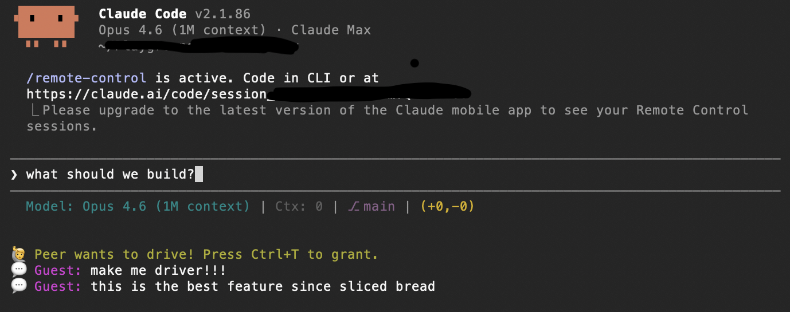

<div align="center">


**E2E encrypted terminal sharing. One hosts, one joins. Zero config.**

</div>

---



## Quick Start

No install needed. Just run:

```bash
# Host starts a session
npx github:neuling/vibe-party host

# Guest joins (code from host's terminal)
npx github:neuling/vibe-party join tiger-piano-4821

# Or pick your own code
npx github:neuling/vibe-party host --code secret-party-1337
```

Works with any CLI tool — not just Claude Code:

```bash
npx github:neuling/vibe-party host --command codex
npx github:neuling/vibe-party host --command aider
npx github:neuling/vibe-party host --command bash
```

Sessions connect to a free public relay (`wss://party.moritz.pro`) by default. If you want full control over your data, [run your own relay](#self-hosting-the-relay) — it takes one command.

## Controls

| Shortcut | Host | Guest |
|----------|------|-------|
| **Ctrl+T** | Grant/revoke drive | Request/release drive |
| **Ctrl+Q** | Quit | Quit |

When the guest is not driving, they can type messages that appear as chat on the other side.

## Security

All terminal data is **end-to-end encrypted** using AES-256-GCM. The session code (e.g. `tiger-piano-4821`) is used to derive the encryption key via PBKDF2. The relay server only sees:

- A hashed room ID (cannot be reversed to the session code)
- Opaque encrypted bytes (cannot be decrypted without the session code)
- IP addresses and packet timing (inherent to any network connection)

The relay **cannot** read your terminal content, keystrokes, or chat messages. Even the relay operator cannot see what you're doing.

That said — if you want to be sure, run your own relay. It's a single Docker container.

## Self-Hosting the Relay

Clone the repo and start the relay:

```bash
git clone https://github.com/neuling/vibe-party.git
cd vibe-party/server
docker compose up -d
```

Then tell both sides to use your relay:

```bash
npx github:neuling/vibe-party host --relay wss://your-server.com
npx github:neuling/vibe-party join <code> --relay wss://your-server.com
```

The relay listens on port 8080 internally. For TLS, put it behind a reverse proxy (nginx, caddy, etc.). See `server/nginx.conf.example` as a starting point.

## How It Works

- **Session codes** (e.g. `tiger-piano-4821`) serve dual purpose: hashed for relay room routing, derived via PBKDF2 for AES-256-GCM encryption. The relay only sees the hash — never the code or the content.
- **Host** spawns any CLI tool in a PTY via node-pty, encrypts all output, streams it through the relay.
- **Guest** decrypts the stream and pipes raw ANSI to their terminal.
- **Driver model**: one person types at a time. Toggle with Ctrl+T. Non-driver can chat.

## Prerequisites

- Node.js 20+
- A CLI tool to share (`claude`, `codex`, `aider`, `bash`, ...) — host only

## Development

```bash
npm install
npm test                    # 31 tests
node server/index.js        # local relay on :8080
node bin/vibe-party.js host --relay ws://localhost:8080
node bin/vibe-party.js join <code> --relay ws://localhost:8080
```

## Credits

Thanks to Alex H. (who doesn't have X) for the name.

## License

MIT
